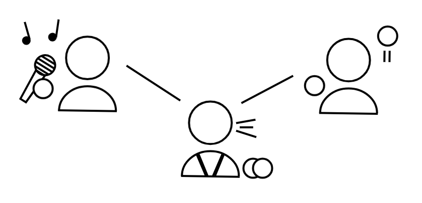

[About Me](#about) | [News](#news) | [Research](#research) | [Publications](#publications) | [Blog](#blog) | [Contact](#contact)

# Building Bridges – Fabian Veider
---

## About Me 
---

Hello there, I'm **Fabian Veider**.  
I am currently pursuing a PhD in Computational Social Sciences as part of the System Science group at the [University of Graz](https://ess.uni-graz.at/en/about-the-department/management-and-employees/). My research within the interdisciplinary [COLIBRI](https://colibri.uni-graz.at/en/doctoral-consortium-complexity-of-life/phd-students/fabian-veider/) group focuses on a theoretical understandinging **polarization**, the role of **influencers** and drivers for **social change**.

Beyond academia, I have a passion for **japanese**, **beatboxing** and **taekwondo**, and I plan to share related content here soon.

    

    <a href="https://www.linkedin.com/in/fabian-veider-67a872241/" style="text-decoration:none; color:black; font-weight:bold; margin-right:10px;">LinkedIn</a> | 
    <a href="https://www.instagram.com/fabian_veider/" style="text-decoration:none; color:black; font-weight:bold; margin-left:10px;">Instagram</a>

---

## News 
---

- 📝 **New Blog Post soon**: *Media Manipulation* (Oct 2025)  
- 🎤 **Talk Accepted**: Winter School on Opinion Dynamics (Dec 2025)  

---

## Research 
---

Here I will share selected research outputs, figures, and notes that support the “Building Bridges” idea. 
These are mixtures of research and opinion, so be aware. The idea is to lay out multiple perspectives on these topics,
allowing everyone to get a better insight into the topic and gain some understanding for people outside of their bubble.

- Visual explorations of **opinion dynamics models**  
- Notes on **ideological polarization**  
- Diagrams of **information flow & media manipulation**  

*(Check back soon for figures and animations.)*

---

## Publications 
---

- Daniel Reisinger, Fabian Tschofenig, Raven Adam, Marie Lisa Kogler, Manfred Füllsack, **Fabian Veider**, and Georg Jäger (2024).  
  *Patterns of stability in complex contagions*. Journal of Computational Social Sciences.  
  [Read here](https://link.springer.com/article/10.1007/s42001-024-00294-3)

---

## Blog 
---

- **[Social Movement Theory](./blog/social-movement-theory.md)**  
  *Coming soon*  

- **[Ideological Polarization](./blog/ideological-polarization.md)**  
  *Coming soon*  

- **[Media Manipulation](./blog/media-manipulation.md)**  
  *Coming soon*  

---

## Contact 
---

**Fabian Veider, MSc**  
PhD Researcher in Computational Social Sciences  
Field of Excellence COLIBRI  
Environmental Systems Sciences  
University of Graz  

**Address:**  
Merangasse 18, 8010 Graz, Austria  

**Phone:**  
+43 (0)316 380 - 1521  

**Email:**  
fabian.veider@uni-graz.at
